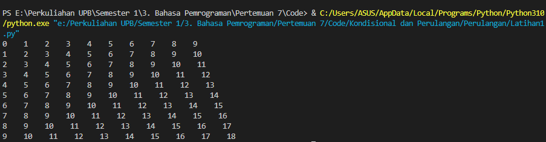

# Praktikum4
Repository ini digunakan untuk memenuhi Tugas Bahasa Pemrograman Pertemuan-7

Nama    : Mohamad Irvan Zidni

NIM     : 312210308

Kelas   : TI.22.A.3

| No | Daftar Isi | Link |
| -- | ---------- | ---- |
| 1 | Praktikum 2 | [Click Here](https://github.com/MohamadIrvanZidni/Praktikum4/blob/main/README.md#praktikum-2) |
| 2 | Praktikum 3 | [Click Here](https://github.com/MohamadIrvanZidni/Praktikum4/blob/main/README.md#praktikum-3) |
| 3 | Kondisional & Perulangan | [Click Here](https://github.com/MohamadIrvanZidni/Praktikum4/blob/main/README.md#kondisional-dan-perulangan) |

# Praktikum 2
## Tugas Praktikum
Program untuk menampilkan bilangan terbesar dari 3 bilangan
Code :

    a = int(input("Bilangan Ke-1 : "))
    b = int(input("Bilangan Ke-2 : "))
    c = int(input("Bilangan Ke-3 : "))

    if a>b and a>c :
        print("Bilangan Terbesar Adalah : ", a)
    elif b>a and b>c :
        print("Bilangan Terbesar Adalah : ", b)
    else :
        print("Bilangan Terbesar Adalah : ", c)
Output :

# Praktikum 3
## Latihan 1
Program untuk menampilkan n bilangan acak yang lebih kecil dari 0.5
Code :

    import random

    jumlah = int(input("Masukkan Jumlah N : "))

    for i in range (jumlah) :
        print("Data ke-", i+1, " adalah ", (random.uniform(0.1, 0.5)))    
Output :

## Latihan 2
Program untuk menampilkan bilangan terbesar dari n buah data yang di inputkan
Code :

    max = 0

    while True :
        a = int(input("Masukkan Bilangan : "))
        if max < a :
            max = a
        if a == 0 :
            break
    print("Bilangan Terbesar Adalah : ", max)

Output :

## Tugas Praktikum 
Program untuk menghitung jumlah laba hasil investasi seorang pengusaha selama 8 bulan
Code :

    a = 100000000

    for x in range (1, 9) :
        if(x>=1 and x<=2) :
            b = a*0
            print("Laba Bulan Ke-", x, " adalah ", b)
        if(x>=3 and x<=4) :
            c = a*0.1
            print("Laba Bulan Ke-", x, " adalah ", c)
        if(x>=5 and x<=7) :
            d = a*0.5
            print("Laba Bulan Ke-", x, " adalah ", d)
        if(x==8) :
            e = a*0.3
            print("Laba Bulan Ke-", x, " adalah ", e)
    total = b+b+c+c+d+d+d+e
    print("Total : ", total)

Output :

# Kondisional dan Perulangan
## Kondisional
### Latihan 1
Program untuk menampilkan bilangan terbesar dari 2 bilangan
Code :

    bil1 = int(input("Masukkan Bilangan Ke-1 : "))
    bil2 = int(input("Masukkan Bilangan Ke-2 : "))

    if(bil1 > bil2) :
        print("Bilangan ", bil1, "Lebih Besar Dari Bilangan ", bil2)
    else :
        print("Bilangan ", bil2, "Lebih Besar Dari Bilangan ", bil1)

Output :

### Latihan 2
Program untuk mengurutkan data berdasarkan input sejumlah data
Code :

    a = int(input("Bilangan Ke-1 : "))
    b = int(input("Bilangan Ke-2 : "))
    c = int(input("Bilangan Ke-3 : "))

    if a<b and a<c :
        if b<c :
            print(a, b, c)
        else :
            print(a, c, b)  
    elif b<a and b<c :
        if a<c :
            print(b, a, c)
        else :
            print(b, c, a)
    else :
        if a<b :
            print(c, b, a)
        else :
            print(c, a, b)

Output :

## Perulangan
### Latihan 1
Program perulangan bertingkat (nested)
Code :

    n = 9

    for i in range (1, n+2) :
        for j in range (0, n+1) :
            print(str(i+j-1)+"  ", end= "  ")
        print()

Output :

### Latihan 2
Program untuk menampilkan n bilangan acak yang lebih kecil dari 0.5
Code :

    import random

    jumlah = int(input("Masukkan Jumlah N : "))

    for i in range (jumlah) :
        print("Data ke-", i+1, " adalah ", (random.uniform(0.1, 0.5)))

Output :

